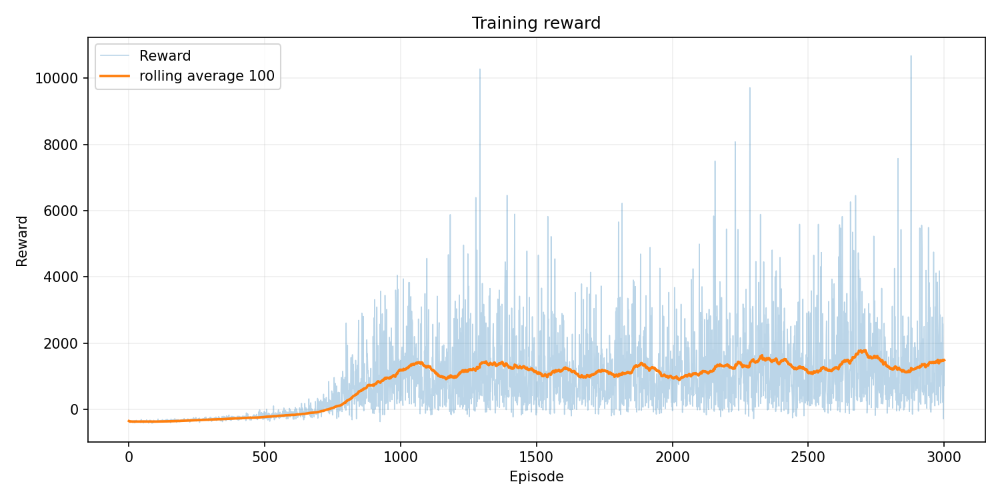
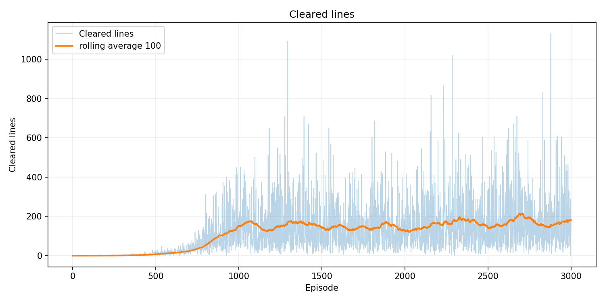
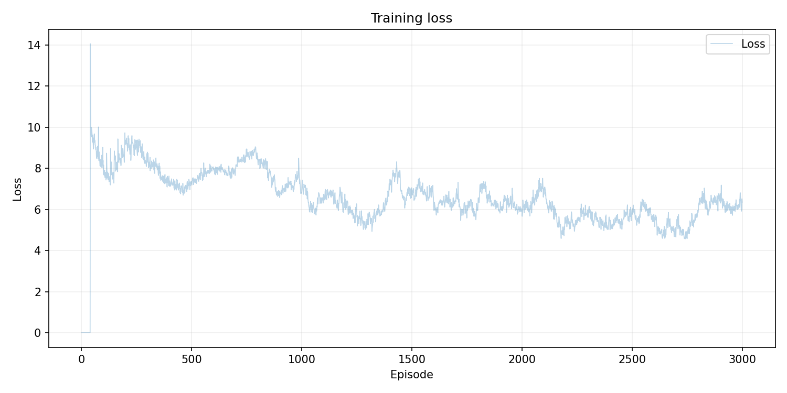

# Tetris RL

Tetris RL — образовательный проект о машинном обучении с подкреплением.

> ### 🕹️ [Сыграть против обученного агента → tetris-rl-web.vercel.app](https://tetris-rl-web.vercel.app/)
>
> Браузерная версия [tetris-rl-web](https://github.com/art-ps/tetris-rl-web):
> человек играет против DQN-агента, обученного в этом проекте. Без установки,
> прямо в браузере.

В нём несколько компьютерных агентов играют в Tetris разными способами:

- случайный агент выбирает ходы наугад;
- эвристический агент следует правилам, написанным человеком;
- DQN-агент учится принимать решения самостоятельно.

Главная цель проекта — простыми шагами показать, как программа может перейти
от случайных действий к стратегии, которую она получила из собственного
опыта.

Инструкции по установке, обучению и запуску находятся в
[INSTALL.md](INSTALL.md).

## Зачем создан этот проект

Проект создан для изучения reinforcement learning, или обучения с
подкреплением.

При обычном программировании человек заранее описывает правильные действия:
«если произошло это, сделай то». В обучении с подкреплением программа получает
другую задачу:

1. наблюдать за состоянием мира;
2. выбирать действие;
3. получать награду или штраф;
4. постепенно понимать, какие решения полезны.

Tetris хорошо подходит для такого эксперимента. Правила игры понятны, но
выбрать хороший ход не всегда просто. Нужно думать не только об одной фигуре,
но и о том, какой станет доска после её размещения.

Это не попытка создать идеального Tetris-бота. Проект специально остаётся
достаточно компактным, чтобы можно было прочитать код и понять каждый этап
обучения.

## Как устроена игра

Игровое поле состоит из 20 строк и 10 столбцов. В игре используются семь
классических фигур:

`I`, `O`, `T`, `S`, `Z`, `J`, `L`.

Поле хранится как таблица чисел:

- `0` означает пустую клетку;
- числа `1..7` обозначают клетки разных фигур.

Когда строка полностью заполняется, она исчезает. Игра заканчивается, когда
для новой фигуры больше нет допустимого места.

Окружение отслеживает:

- игровой score;
- количество очищенных линий;
- количество размещённых фигур;
- высоту башни;
- количество дыр;
- текущую и следующую фигуры.

## Почему действия упрощены

В обычном Tetris игрок нажимает кнопки в реальном времени: двигает фигуру
влево и вправо, вращает её и ждёт падения.

В этом проекте агент принимает решение целиком:

```text
действие = нужный поворот + конечная позиция по горизонтали
```

Окружение перебирает все допустимые варианты:

1. берёт каждый возможный поворот текущей фигуры;
2. проверяет каждую допустимую позицию по горизонтали;
3. опускает фигуру до столкновения;
4. создаёт доску, которая получится после этого хода.

Агенту остаётся выбрать лучший готовый вариант.

Такое упрощение позволяет сосредоточиться на обучении стратегии, а не на
имитации нажатий клавиш. Оно также заметно ускоряет обучение DQN.

## Что такое агент

Агент — это программа, которая видит доступные действия и выбирает одно из
них.

Все агенты играют в одном и том же окружении и получают одинаковые фигуры.
Разница только в способе выбора хода. Благодаря этому их можно честно
сравнивать.

## Random Agent

Random Agent — самый простой агент. Он получает список допустимых ходов и
выбирает случайный.

Он не анализирует доску, не помнит прошлые игры и не пытается строить
стратегию.

Представьте ученика, который отвечает на каждый вопрос теста случайной буквой.
Иногда ответ окажется правильным, но стабильного результата не будет.

Random Agent нужен не для хорошей игры, а как нижняя точка сравнения. Если
более сложный агент играет не лучше случайного, значит в его логике или
обучении есть проблема.

В проведённой оценке Random Agent в среднем очищал только `0.30` линии.

## Heuristic Agent

Heuristic Agent не учится. Его стратегия полностью написана человеком.

Слово «эвристика» означает практическое правило, которое обычно помогает
найти хорошее решение, но не гарантирует идеальный результат.

Для каждого допустимого хода агент смотрит на получившуюся доску и вычисляет
оценку:

```text
score =
    -0.5 * aggregate_height
    -0.7 * holes
    -0.3 * bumpiness
    +1.0 * completed_lines
```

Разберём эту формулу простыми словами.

### Aggregate height

Это сумма высот всех столбцов.

Чем выше становится вся конструкция, тем ближе проигрыш. Поэтому большая
суммарная высота уменьшает оценку хода.

### Holes

Дыра — пустая клетка, над которой уже лежит хотя бы один блок.

До такой клетки трудно добраться: сначала придётся убрать всё, что находится
выше. Поэтому дыры особенно опасны и получают большой штраф.

### Bumpiness

Bumpiness показывает, насколько сильно отличаются высоты соседних столбцов.

Ровную поверхность обычно проще заполнять новыми фигурами. Большие ступеньки
и глубокие перепады усложняют игру, поэтому агент старается их избегать.

### Completed lines

За очищенные линии агент получает положительную оценку.

В итоге Heuristic Agent выбирает ход, который оставляет доску низкой, ровной и
без дыр, а также старается очищать линии.

Это уже сильная стратегия. Но её знания ограничены правилами, которые заранее
придумал разработчик.

## DQN Agent

DQN Agent использует нейронную сеть и учится на собственных партиях.

DQN расшифровывается как Deep Q-Network:

- `Deep` означает, что используется многослойная нейронная сеть;
- `Q` — оценка того, насколько полезным будет состояние;
- `Network` — сама нейронная сеть.

Вместо готовой человеческой формулы DQN получает примеры ходов и постепенно
настраивает внутренние веса сети.

### Что получает нейросеть

Нейросеть не смотрит на картинку игрового поля напрямую. Каждая возможная
доска превращается в набор из 23 чисел:

- суммарная высота;
- максимальная высота;
- количество дыр;
- неровность поверхности;
- количество очищенных линий;
- глубина колодцев;
- высота каждого из 10 столбцов;
- обозначение следующей фигуры.

Такой набор называется feature vector, или вектор признаков.

### Архитектура сети

В проекте используется небольшая полносвязная нейронная сеть:

```text
23 признака -> 128 -> 128 -> 64 -> 1 оценка
```

Последнее число — Q-value. Чем оно выше, тем более полезной сеть считает
кандидатную доску.

Для выбора хода DQN:

1. получает все допустимые размещения;
2. вычисляет признаки каждого результата;
3. передаёт их в нейронную сеть;
4. выбирает вариант с самой высокой оценкой.

## Как DQN учится

В начале нейросеть ничего не знает о Tetris. Её веса случайны, поэтому решения
почти бессмысленны.

Во время игры агент сохраняет переходы:

```text
состояние -> награда -> следующее состояние -> закончилась ли игра
```

Затем сеть учится предсказывать, какие состояния приводят к большей будущей
награде.

### Награда

После каждого хода агент получает числовой сигнал:

```text
+ 10 за каждую очищенную линию
+ 50 дополнительно за четыре линии сразу
- 2 за каждую созданную дыру
- 0.5 за увеличение суммарной высоты
- 0.2 за увеличение неровности
- 100 за проигрыш
```

Награда похожа на советы учителя:

- «очистил линию — хорошо»;
- «создал дыру — плохо»;
- «слишком высоко построил — опасно».

Она не говорит, какой конкретно ход выбрать. Агент должен сам связать действия
с их последствиями.

### Exploration и exploitation

Если агент всегда выбирает только лучший известный ход, он может никогда не
обнаружить более удачную стратегию.

Поэтому используется epsilon-greedy подход:

- иногда агент исследует игру и делает случайный ход;
- в остальных случаях использует лучший ход по мнению сети.

В начале обучения случайных действий много. Постепенно epsilon уменьшается, и
агент всё чаще доверяет накопленному опыту.

### Replay Buffer

Replay Buffer — память с примерами прошлых ходов.

Вместо обучения только на последнем событии агент случайно выбирает целую
группу старых переходов. Это похоже на ученика, который повторяет задачи из
разных частей учебника, а не только последнюю решённую задачу.

Буфер хранит до `50 000` переходов. Случайное перемешивание делает обучение
более стабильным.

### Online Network и Target Network

DQN использует две одинаковые сети:

- Online Network обучается после каждого шага;
- Target Network некоторое время остаётся неизменной и помогает вычислять
  учебную цель.

Если пытаться одновременно менять и предсказание, и цель, обучение становится
нестабильным. Поэтому веса Target Network обновляются реже, копированием из
Online Network.

### Checkpoints

Во время обучения веса сети сохраняются в checkpoint-файлы.

Проект сохраняет:

- периодические checkpoints;
- `best.pt` с лучшим результатом проверки;
- `final.pt` после последнего эпизода.

Checkpoint позволяет продолжить работу с уже обученной сетью и показать её
игру без повторного обучения.

## Состояние и признаки доски

Несколько терминов, которые используются агентами:

| Признак | Простое объяснение |
| --- | --- |
| Aggregate height | сумма высот всех столбцов |
| Max height | высота самого высокого столбца |
| Holes | пустые клетки под установленными блоками |
| Bumpiness | разница высот соседних столбцов |
| Completed lines | линии, очищенные текущим ходом |
| Wells | глубокие пустые участки между высокими столбцами |
| Column heights | отдельная высота каждого столбца |
| Piece one-hot | семь чисел, обозначающих тип фигуры |

Большинство значений нормализуется. Например, высота делится на высоту поля.
Это помогает нейросети работать с числами похожего масштаба.

## Как проходит один эпизод обучения

Эпизод — одна партия от пустого поля до проигрыша или установленного лимита
ходов.

Один эпизод выглядит так:

1. Окружение создаёт пустую доску и первую фигуру.
2. Для текущей фигуры генерируются все допустимые размещения.
3. DQN выбирает случайное или лучшее известное размещение.
4. Фигура фиксируется, заполненные линии удаляются.
5. Агент получает награду.
6. Переход сохраняется в Replay Buffer.
7. Из памяти выбирается случайная группа переходов.
8. Online Network делает шаг обучения.
9. Иногда обновляется Target Network.
10. Процесс повторяется до завершения партии.

После эпизода уменьшается epsilon и сохраняются метрики.

## Визуализация

Pygame-визуализация показывает игру Random, Heuristic и обученного DQN Agent.

Хотя окружение принимает готовое финальное размещение, viewer делает ход
наглядным:

- показывает текущую и следующую фигуры;
- отображает разные цвета фигур;
- анимирует вращение из начальной ориентации;
- анимирует падение от верхнего края;
- показывает score, reward, линии и количество фигур.

Анимация не влияет на решения агента. Она нужна только человеку, чтобы было
легче наблюдать за игрой.

## Результаты

После обучения на `3000` эпизодах агенты были проверены на одинаковых seeds.
Для каждого evaluation-эпизода использовался лимит `1000` фигур.

| Agent | Средний score | Средние линии | Среднее число фигур | Средний reward |
| --- | ---: | ---: | ---: | ---: |
| Random | 30 | 0.30 | 24.5 | -387.3 |
| Heuristic | 32 480 | 302.20 | 788.1 | 2 661.1 |
| DQN `best.pt` | **51 710** | **396.80** | **1 000.0** | **4 063.6** |

DQN достиг лимита в `1000` фигур во всех десяти проверочных эпизодах и
превзошёл эвристику по среднему score, количеству линий и reward.

Во время обучения:

- в начале агент почти не очищал линии;
- заметное улучшение началось примерно после 700–800 эпизодов;
- лучший rolling average за 100 эпизодов достиг `213.92` линии;
- финальный rolling average составил `181.08` линии.

### Reward



### Cleared lines



### Loss



## Чему учит этот проект

На примере проекта можно изучить:

- устройство собственного RL-окружения;
- разницу между случайной, ручной и обучаемой стратегией;
- подготовку признаков состояния;
- reward shaping;
- epsilon-greedy exploration;
- Replay Buffer;
- Online и Target Networks;
- обучение модели в PyTorch;
- сохранение checkpoints и метрик;
- оценку и визуальное сравнение агентов.

Главный вывод эксперимента: даже небольшая нейронная сеть может научиться
полезной стратегии, если дать ей понятное окружение, информативные признаки,
награду и достаточно опыта.

## Структура проекта

```text
tetris-rl/
├── configs/                # параметры обучения
├── checkpoints/            # сохранённые веса DQN
├── runs/                   # метрики и графики обучения
├── scripts/                # обучение, оценка, визуализация, графики
├── tests/                  # автоматические тесты
└── tetris_rl/
    ├── env/                # правила игры и признаки доски
    ├── agents/             # Random, Heuristic и DQN agents
    ├── models/             # нейронная сеть
    ├── training/           # Replay Buffer, trainer и метрики
    ├── utils/              # конфигурация и seed
    └── visualization/      # Pygame viewer
```

## Ограничения и идеи развития

Текущая версия специально упрощена для обучения и демонстрации:

- агент выбирает готовое размещение, а не управляет фигурой по кадрам;
- нейросеть получает числовые признаки, а не изображение поля;
- reward и гиперпараметры можно дополнительно настраивать;
- обучение не продолжается автоматически из checkpoint;
- не используется CNN или prioritized replay.

Возможные следующие шаги:

- добавить CNN, которая получает сырую доску `20 x 10`;
- добавить TensorBoard;
- продолжать обучение из checkpoint;
- экспортировать GIF или видео;
- сравнивать несколько конфигураций обучения;
- добавить GitHub Actions и Docker.

